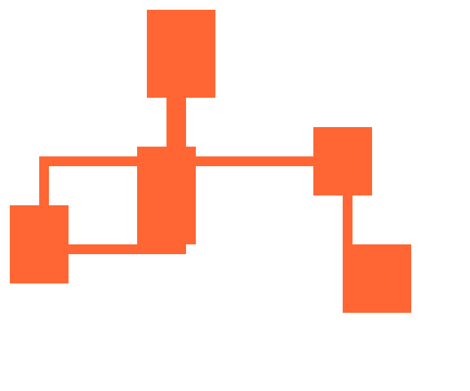

# Procedural level generation with Rust

Procedural generation is a technique which allows content to be created programmatically, rather than everything in a game being specifically placed by a designer. Procedural generation doesn't mean completely randomised, rather randomised elements are used as long as they make sense.

This tutorial will show how to create a tilemap-based level with rooms connected by straight corridors, using [Rust](https://www.rust-lang.org/en-US/). We'll also cover how to use seeds to reproduce specific layouts and serialise the output into JSON. The rooms will be placed at random within the level, and corridors are drawn horizontally and vertically to connect the centres of the rooms.

Here's an example level created:
<video controls>
    <source src="./levelgen.mp4" type="video/mp4">
</video>



## Setup
You'll need to [install Rust](https://www.rust-lang.org/en-US/) - this tutorial uses version `1.27.0`. Once installed, create a binary project with Cargo:

```cargo new dungeon --bin```

Once created, change into the new folder and run the project to check everything's ok:

```
cd dungeon
cargo run

// => "Hello world!"
```

After compiling, the project should print out "Hello world!" - this is the default boilerplate for projects set up with Cargo.

## Create the board

The first step is to create the tilemap which will keep track of empty space and rooms in our level. In `src/main.rs` we'll create a struct to hold this data:

```
// main.rs

#[derive(Debug)]
struct Level {
    width: i32,
    height: i32,
    board: Vec<Vec<i32>>
}

impl Level {
    fn new(width: i32, height: i32) -> Self {
        let mut board = Vec::new();
        for _ in 0..height {
            let row = vec![0; width as usize];
            board.push(row);
        }

        Level {
            width,
            height,
            board
        }
    }
}

fn main() {
    println!("Hello, world!");
    let level = Level::new(10, 8);
    println!("{:?}", level);
}
```

When run, this will give you the "Hello world!" phrase, followed by the level, which at the moment is just loads and loads of zeros:

```
Hello, world!
Level { width: 10, height: 8, board: [[0, 0, 0, 0, 0, 0, 0, 0, 0, 0], [0, 0, 0, 0, 0, 0, 0, 0, 0, 0], [0, 0, 0, 0, 0, 0, 0, 0, 0, 0], [0, 0, 0, 0, 0, 0, 0, 0, 0, 0], [0, 0, 0, 0, 0, 0, 0, 0, 0, 0], [0, 0, 0, 0, 0, 0, 0, 0, 0, 0], [0, 0, 0, 0, 0, 0, 0, 0, 0, 0], [0, 0, 0, 0, 0, 0, 0, 0, 0, 0]] }
```

The `Level` struct is pretty basic for now:
```
#[derive(Debug)]
struct Level {
    width: i32,
    height: i32,
    board: Vec<Vec<i32>>
}
```
It contains width and height values, which mark the size of the level. Our example is 10 tiles wide and 8 tiles high - if each tile is 16 pixels, this would make the map dimensions 768x600 pixels.

We're using a two-dimensional array (ie an array containing arrays) to represent the map (`board` in the struct). Zero means an empty space, so when we initialise the map everything is empty; rooms and corridors will use ones when we add them. Each array inside `board` represents a row, and each entry in that array represents a position in that row. For instance, the co-ordinate (8, 6) would be `board[6][8]` in our struct - the `y` co-ordinate (6) becomes the first slice parameter to get the row array, then we use the `x` co-ordinate (8) to get the appropriate item.

You can also use a single-dimension array as the board - there are no nested arrays, so you can directly access each position on the board. This is faster than using a two-dimensional array, but comes at the cost of being slightly less clear, so we'll use the two-dimensional array for now.

We've also added a `new` function to the `Level` struct:

```
impl Level {
    fn new(width: i32, height: i32) -> Self {
        let mut board = Vec::new();
        for _ in 0..height {
            let row = vec![0; width as usize];
            board.push(row);
        }

        Level {
            width,
            height,
            board
        }
    }
}
```

This sets the width and height properties of the struct, and creates a vector for each row:

```
let row = vec![0; width as usize];
```

Each row is set to contain `width` number of elements, all set to `0`; all these rows are then added to the `board` vector and added to the `Level` struct. In Rust, vectors are growable arrays which adds a bit of overhead since they need to be able to resize. If we had a static size for the board, so we didn't have `width` and `height` in the `Level` struct, then we could use an array for the board instead of a Vector. Since we're dynamically creating the board size from the width and height, we'll need to use a vector instead.

## Display
The `#[derive(Debug)]` lets us print out the contents of our level, but this is a bit of a mess at the moment with a single line of zeroes. To allow custom formatting, we need to derive the `Display` trait on `Level` so we can print out a nice map. The `Display` trait is pretty simple: we just need to provide a `fmt` function in an implementation block for our struct, and in the function we can print out whatever we like.

```
use std::fmt;

struct Level {
    ...
}

impl Level {
    ...
}

impl fmt::Display for Level {
    fn fmt(&self, f: &mut fmt::Formatter) -> fmt::Result {
        for row in 0..self.height as usize {
            for col in 0..self.width as usize {
                write!(f, "{:?} ", self.board[row][col])?
            }
            write!(f, "\n")?
        }

        Ok(())
    }
}

fn main() {
    let level = Level::new(10, 8);
    println!("{}", level); // note this has changed from {:?} to {} (debug vs display)
}
```

In the `fmt` function, we're looping through each entry in the board and printing out the `{:?}` debug string, since each entry is an integer, along with a space, and for each row array we add a line break. Also notice that in `main` the println has changed from `{:?}` to `{}` - the former is for debug printing, and the latter uses our new `Display` formatting.

Run this code, and the level should look a bit nicer:

```
0 0 0 0 0 0 0 0 0 0
0 0 0 0 0 0 0 0 0 0
0 0 0 0 0 0 0 0 0 0
0 0 0 0 0 0 0 0 0 0
0 0 0 0 0 0 0 0 0 0
0 0 0 0 0 0 0 0 0 0
0 0 0 0 0 0 0 0 0 0
0 0 0 0 0 0 0 0 0 0
```

## Room
Right, it looks nicer now, but is very boring. Let's do the fun bit, and add some rooms to our map!

Create `src/room.rs` and add the following:

```
// room.rs

pub struct Room {
    pub x: i32,
    pub y: i32,
    pub x2: i32,
    pub y2: i32,
    pub width: i32,
    pub height: i32,
    pub centre: (i32, i32)
}

impl Room {
    pub fn new(x: i32, y: i32, width: i32, height: i32) -> Self {
        Room {
            x,
            y,
            x2: x + width,
            y2: y + height,
            width,
            height,
            centre: (x + (width / 2), y + (height / 2))
        }
    }

    pub fn intersects(&self, other: &Self) -> bool {
        self.x <= other.x2 && self.x2 >= other.x && self.y <= other.y2 && self.y2 >= other.y
    }
}
```

The `Room` struct contains the points of the room's rectangle, along with its' width, height and centre point. The `new` function saves us having to calculate the points and centre when we call it, and the `intersects` function will be used when placing rooms to make sure the rooms aren't overlapping.


### Refactor Level
Before we start using `Room`, let's tidy up the `Level` struct. Create `src/level.rs` and move all the level-related code into it; update `struct Level` to `pub struct level` and `fn new` to `pub fn new`:

```
// level.rs
use std::fmt;

pub struct Level {
    width: i32,
    height: i32,
    board: Vec<Vec<i32>>
}

impl Level {
    pub fn new(width: i32, height: i32) -> Self {
        let mut board = Vec::new();
        for _ in 0..height {
            let row = vec![0; width as usize];
            board.push(row);
        }

        Level {
            width,
            height,
            board
        }
    }
}

impl fmt::Display for Level {
    fn fmt(&self, f: &mut fmt::Formatter) -> fmt::Result {
        for row in 0..self.height as usize {
            for col in 0..self.width as usize {
                write!(f, "{:?} ", self.board[row][col])?
            }
            write!(f, "\n")?
        }

        Ok(())
    }
}
```

The `pub` annotations allow the struct to be used in other files in our project, otherwise we'd have errors when trying to run the project.

Update `main.rs` to declare and use `Level`:

```
// main.rs
mod level;

use level::Level;

fn main() {
    let level = Level::new(10, 8);
    println!("{}", level);
}
```

`mod level` declares the level module, then `use level::Level` imports the struct into the main file. Compile and run again to check that everthing's still working with `cargo run` - you should see the board again.

Let's actually add rooms now! First of all, we need to add the `rand` crate to our project; this provides random-number functionality which we can use to get different-sized rooms. In `Cargo.toml`, add `rand = "0.5"` under the `[dependencies]`:

```
# Cargo.toml

[dependencies]
rand = "0.5"
```

We now need to declare that we're using this crate in `main.rs` - at the top of the file, add `extern crate rand;`:

```
// main.rs
extern crate rand;
...
```

And in `level.rs` we add a `use` statement so it gets imported:

```
// level.rs
use rand;
use rand::prelude::*;
use std::fmt;
...
```

Run `cargo run` - this will download and compile the `rand` crate, then print out exactly the same board as before. The `use rand::prelude::*` statement imports standard traits and functions from the rand crate - this is a shortcut to having to know exactly which imports you want and listing them all out.

We now need to add a vector to the level to track rooms - this will be used to make sure that no rooms overlap - and add a function which places them.

```
// level.rs
use std::fmt;
use rand;
use rand::prelude::*;
use room::Room;     // use Room struct

pub struct Level {
    width: i32,
    height: i32,
    board: Vec<Vec<i32>>,
    rooms: Vec<Room>    // keep track of rooms
}

impl Level {
    pub fn new(width: i32, height: i32) -> Self {
        let mut board = Vec::new();
        for _ in 0..height {
            let row = vec![0; width as usize];
            board.push(row);
        }

        Level {
            width,
            height,
            board,
            rooms: Vec::new()   // initialise Room array
        }
    }

    // create rooms in the level
    pub fn place_rooms(&mut self, rng: &mut StdRng) {
        // create a random number generator
        let mut rng = rand::thread_rng();

        // configure room sizes
        let max_rooms = 10;
        let min_room_width = 4;
        let max_room_width = 8;
        let min_room_height = 5;
        let max_room_height = 12;

        for _ in 0..max_rooms {
            // place up to max_rooms - if it collides with another, it won't get placed

            let mut x = rng.gen_range(0, self.width);
            let mut y = rng.gen_range(0, self.height);

            let width = rng.gen_range(min_room_width, max_room_width);
            let height = rng.gen_range(min_room_height, max_room_height);

            // if it's off the board, shift it back on again
            if x + width > self.width {
                x = self.width - width;
            }

            if y + height > self.height {
                y = self.height - height;
            }

            let mut collides = false;
            let room = Room::new(x, y, width, height);

            // check all other rooms we've placed to see if this one
            // collides with them
            for other_room in &self.rooms {
                if room.intersects(&other_room) {
                    collides = true;
                    break;
                }
            }

            // if the new room doesn't collide, add it to the level
            if !collides {
                self.add_room(&room);
            }
        }
    }

    fn add_room(&mut self, room: &Room) {
        // loop through all items in the board which are covered by the new room
        // and change them to '1' which indicates they are not empty
        for row in 0..room.height {
            for col in 0..room.width {
                let y = (room.y + row) as usize;
                let x = (room.x + col) as usize;

                self.board[y][x] = 1;
            }
        }

        // also keep track of rooms so that we can check for collisions
        self.rooms.push(*room);
    }
}

impl fmt::Display for Level {
    fn fmt(&self, f: &mut fmt::Formatter) -> fmt::Result {
        for row in 0..self.height as usize {
            for col in 0..self.width as usize {
                write!(f, "{:?} ", self.board[row][col])?
            }
            write!(f, "\n")?
        }

        Ok(())
    }
}

```

You'll notice that the `self.rooms.push(*room)` throws an error - this is because we only have a reference to `room` (ie it's passed to `add_room` as `&Room`) so we can't move the struct itself into our `rooms` array. We could change the parameter to remove the borrow (ie `fn add_room(&mut self, room: Room)`), but this will make things a bit hairy later on when we need to use the room data again. Instead, we can derive the Copy trait on `Room` so that the `rooms` vector has a copy of the room instead of the original struct:

```
// room.rs
#[derive(Clone, Copy)]
pub struct Room {
    ...
}
```

The Copy trait requires the Clone trait to be satisfied, so we add both to the room.

Finally, we need to actually call our new function - update `main` to place rooms:

```
extern crate rand;

mod room;
mod level;

use level::Level;

fn main() {
    let mut level = Level::new(48, 40);     // make the map bigger so there's space for rooms
    level.place_rooms();
    println!("{}", level);
}
```

When run, we now have rooms!

```
0 0 0 0 0 0 0 0 0 0 0 0 0 0 0 0 0 0 0 0 0 0 0 0 0 0 0 0 0 0 0 0 0 0 0 0 0 0 0 0 1 1 1 1 0 0 0 0
0 0 0 0 0 0 0 0 0 0 0 0 0 0 0 0 0 0 0 0 0 0 0 0 0 0 0 0 0 0 0 0 0 0 0 0 0 0 0 0 1 1 1 1 0 0 0 0
0 0 0 0 0 0 0 0 0 0 0 0 0 0 0 0 0 0 0 0 0 0 0 0 0 0 0 0 0 0 0 0 0 0 0 0 0 0 0 0 1 1 1 1 0 0 0 0
0 0 0 0 0 0 0 0 0 0 0 0 0 0 0 0 0 0 0 0 0 0 0 0 0 0 0 0 0 0 0 0 0 0 0 0 0 0 0 0 1 1 1 1 0 0 0 0
0 0 0 0 0 0 0 0 0 0 0 0 0 0 0 0 0 0 0 0 0 0 0 0 0 0 0 0 0 0 0 0 0 0 0 0 0 0 0 0 1 1 1 1 0 0 0 0
0 0 0 0 0 0 0 0 0 0 0 0 0 0 0 0 0 0 0 0 0 0 0 0 0 0 0 0 0 0 0 0 0 0 0 0 0 0 0 0 1 1 1 1 0 0 0 0
0 0 0 0 0 0 0 0 0 0 0 0 0 0 0 0 0 0 0 0 0 0 0 0 0 0 0 0 0 0 0 0 0 0 0 0 0 0 0 0 1 1 1 1 0 0 0 0
0 0 0 0 0 0 0 0 0 1 1 1 1 0 0 0 0 0 0 0 0 0 0 0 0 0 0 0 0 0 0 0 0 0 0 0 0 0 0 0 1 1 1 1 0 0 0 0
0 0 0 0 0 0 0 0 0 1 1 1 1 0 0 0 0 0 0 1 1 1 1 0 0 0 0 0 0 0 0 0 0 0 0 0 0 0 0 0 1 1 1 1 0 0 0 0
0 0 0 0 0 0 0 0 0 1 1 1 1 0 0 0 0 0 0 1 1 1 1 0 0 0 0 0 0 0 0 0 0 0 0 0 0 0 0 0 1 1 1 1 0 0 0 0
0 0 0 0 0 0 0 0 0 1 1 1 1 0 0 0 0 0 0 1 1 1 1 0 0 0 0 0 0 0 0 0 0 0 0 0 0 0 0 0 0 0 0 0 0 0 0 0
0 0 0 0 0 0 0 0 0 1 1 1 1 0 0 0 0 0 0 1 1 1 1 0 0 0 0 0 0 0 0 0 0 0 0 0 0 0 0 0 0 0 0 0 0 0 0 0
0 0 0 0 0 0 0 0 0 1 1 1 1 0 0 0 0 0 0 1 1 1 1 0 0 0 0 0 0 0 0 0 0 0 0 0 0 0 0 0 0 0 0 0 0 0 0 0
0 0 0 0 0 0 0 0 0 1 1 1 1 0 0 0 0 0 0 1 1 1 1 0 0 0 0 0 0 0 0 0 0 0 0 0 0 0 0 0 0 0 0 0 0 0 0 0
0 0 0 0 0 0 0 0 0 1 1 1 1 0 0 0 0 0 0 1 1 1 1 0 0 0 0 0 0 0 0 0 0 0 0 0 0 0 0 0 0 0 0 0 0 0 0 0
0 0 0 0 0 0 0 0 0 1 1 1 1 0 0 0 0 0 0 1 1 1 1 0 0 0 0 0 0 0 0 0 0 0 0 0 0 0 0 0 0 0 0 0 0 0 0 0
0 0 0 0 0 0 0 0 0 1 1 1 1 0 0 0 0 0 0 1 1 1 1 0 0 0 0 0 0 0 0 0 0 0 0 0 0 0 0 0 0 0 1 1 1 1 1 1
0 0 0 0 0 0 0 0 0 1 1 1 1 0 0 0 0 0 0 1 1 1 1 0 0 0 0 0 0 0 0 0 0 0 0 0 0 0 0 0 0 0 1 1 1 1 1 1
0 0 0 0 0 0 0 0 0 0 0 0 0 0 0 0 0 0 0 1 1 1 1 0 0 0 0 0 0 0 0 0 0 0 0 0 0 0 0 0 0 0 1 1 1 1 1 1
0 0 0 0 0 0 1 1 1 1 1 1 0 0 0 0 0 0 0 0 0 0 0 0 0 0 0 0 0 0 0 0 0 0 0 0 0 0 0 0 0 0 1 1 1 1 1 1
0 0 0 0 0 0 1 1 1 1 1 1 0 0 0 0 1 1 1 1 1 1 1 0 0 0 0 0 0 0 0 0 0 0 0 0 0 0 0 0 0 0 1 1 1 1 1 1
0 0 0 0 0 0 1 1 1 1 1 1 0 0 0 0 1 1 1 1 1 1 1 0 0 0 0 0 0 0 0 0 0 0 0 0 0 0 0 0 0 0 0 0 0 0 0 0
1 1 1 1 1 0 1 1 1 1 1 1 0 0 0 0 1 1 1 1 1 1 1 0 0 0 0 0 0 0 0 0 0 0 0 0 0 0 0 0 0 0 0 0 0 0 0 0
1 1 1 1 1 0 1 1 1 1 1 1 0 0 0 0 1 1 1 1 1 1 1 0 0 0 0 0 0 0 0 0 0 0 0 0 0 0 0 0 0 0 0 0 0 0 0 0
1 1 1 1 1 0 0 0 0 0 0 0 0 0 0 0 1 1 1 1 1 1 1 0 0 0 0 0 0 0 0 0 0 0 0 0 0 0 0 0 0 0 0 0 0 0 0 0
1 1 1 1 1 0 0 0 0 0 0 0 0 0 0 0 1 1 1 1 1 1 1 0 0 0 0 0 0 0 0 0 0 0 0 0 0 0 0 0 0 0 0 0 0 0 0 0
1 1 1 1 1 0 0 0 0 0 0 0 0 0 0 0 1 1 1 1 1 1 1 0 0 0 0 0 0 0 0 0 0 0 0 0 0 0 0 0 0 0 1 1 1 1 1 1
1 1 1 1 1 0 0 0 0 0 0 0 0 0 0 0 1 1 1 1 1 1 1 0 0 0 0 0 0 0 0 0 0 0 0 0 0 0 0 0 0 0 1 1 1 1 1 1
1 1 1 1 1 0 0 0 0 0 0 0 0 0 0 0 1 1 1 1 1 1 1 0 0 0 0 0 0 0 0 0 0 0 0 0 0 0 0 0 0 0 1 1 1 1 1 1
1 1 1 1 1 0 0 0 0 0 0 0 0 0 0 0 1 1 1 1 1 1 1 0 0 0 0 0 0 0 0 0 0 0 0 0 0 0 0 0 0 0 1 1 1 1 1 1
1 1 1 1 1 0 0 0 0 0 0 0 0 0 0 0 0 0 0 0 0 0 0 0 0 0 0 0 0 0 0 0 0 0 0 0 0 0 0 0 0 0 1 1 1 1 1 1
1 1 1 1 1 0 0 0 0 0 0 0 0 0 0 0 0 0 0 0 0 0 0 0 0 0 0 0 0 0 0 0 0 0 0 0 0 0 0 0 0 0 1 1 1 1 1 1
1 1 1 1 1 0 0 0 0 0 0 0 0 0 0 0 0 0 0 0 0 0 0 0 0 0 0 0 0 0 0 0 0 0 0 0 0 0 0 0 0 0 1 1 1 1 1 1
0 0 0 0 0 0 0 0 0 0 0 0 0 0 0 0 0 0 0 0 0 0 0 0 0 0 0 0 0 0 0 0 0 0 0 0 0 0 0 0 0 0 1 1 1 1 1 1
0 0 0 0 0 0 0 0 0 0 0 0 0 0 0 0 0 0 0 0 0 0 0 0 0 0 0 0 0 0 0 0 0 0 0 0 0 0 0 0 0 0 1 1 1 1 1 1
0 0 0 0 0 0 0 0 0 0 0 0 0 0 0 0 0 0 0 0 0 0 0 0 0 0 0 0 0 0 0 0 0 0 0 0 0 0 0 0 0 0 0 0 0 0 0 0
0 0 0 0 0 0 0 0 0 0 0 0 0 0 0 0 0 0 0 0 0 0 0 0 0 0 0 0 0 0 0 0 0 0 0 0 0 0 0 0 0 0 0 0 0 0 0 0
0 0 0 0 0 0 0 0 0 0 0 0 0 0 0 0 0 0 0 0 0 0 0 0 0 0 0 0 0 0 0 0 0 0 0 0 0 0 0 0 0 0 0 0 0 0 0 0
0 0 0 0 0 0 0 0 0 0 0 0 0 0 0 0 0 0 0 0 0 0 0 0 0 0 0 0 0 0 0 0 0 0 0 0 0 0 0 0 0 0 0 0 0 0 0 0
0 0 0 0 0 0 0 0 0 0 0 0 0 0 0 0 0 0 0 0 0 0 0 0 0 0 0 0 0 0 0 0 0 0 0 0 0 0 0 0 0 0 0 0 0 0 0 0
```

## Seedable
If you run the programme several times, you'll notice that the layout changes each time. When using procedural generation, it's nice to have reproducible output so you can re-use levels you like. The way we do this is by using a seedable random number generator, which will produce the same random numbers when given the same initial value. This means that every time we use the same seed, we'll get the same level out, which is how things like the Spelunky daily challenges work - everyone gets the same seed which generates the same levels.

The `rand` crate provides this functionality, so we all we need to do is change where the type of random number generator, and make sure we use the same one throughout the code.

I've found the `SeedableRng` provided by the `rand` crate to be a bit picky in what it accepts as a seed, so we'll add a couple of crates to help create a seed in the correct format.

In Cargo.toml, add `sha2` and `arrayref` crates:

```
# Cargo.toml
[dependencies]
arrayref = "0.3.4"
rand = "0.5"
sha2 = "0.7.1"
```

`SeedableRng` requires an array of 32 `u8` items, so these crates will help us turn a string of text into the appropriate format. `Sha2` provides hash functions, so we can use this to turn a string of any length into a string 64 characters long; `arrayref` provides a macro to turn a string's bytes into the format required by `SeedableRng` because it can't accept String::as_bytes directly.

In `main.rs`, we need to declare the crates and use them, then set up the hash to pass into the random number generator:

```
// main.rs
extern crate rand;

// import crates
extern crate sha2;

// arrayref supplies a macro, so add annotation
#[macro_use]
extern crate arrayref;

mod room;
mod level;

// use the sha functions
use sha2::{ Sha256, Digest };
use rand::prelude::*;
use level::Level;

// turn a string into a string 64 characters in length
fn create_hash(text: &str) -> String {
    let mut hasher = Sha256::default();
    hasher.input(text.as_bytes());
    format!("{:x}", hasher.result())
}

fn main() {
    // this string can be anything
    let hash = create_hash("manuelneuersweeperkeeper");

    // turn the hashed string into the correct length and type required by SeedableRng
    let seed = array_ref!(hash.as_bytes(), 0, 32);

    // create the random number generator
    // this will be used everywhere we need randomness so
    // that the output is reproducible
    let mut rng: StdRng = SeedableRng::from_seed(*seed);

    let mut level = Level::new(48, 40);

    // pass the rng into 'place_rooms'
    level.place_rooms(&mut rng);
    println!("{}", level);
}
```

And then tweak `level.rs` so `place_rooms` takes `rng` as a parameter

```
use std::fmt;
// removed use rand;
use rand::prelude::*;
use room::Room;

pub fn place_rooms(&mut self, rng: &mut StdRng) {

    // removed let mut rng = rand::thread_rng();
    let max_rooms = 10;
    let min_room_width = 4;
    let max_room_width = 8;
    ...
```
Run the project again - `cargo run` - Cargo will download the crates then compile the project. You should now see the same map every time you run the project - try changing the hash string for different maps.

### Full listing
#### main.rs
```
extern crate rand;
extern crate sha2;
#[macro_use]
extern crate arrayref;

mod room;
mod level;

use sha2::{ Sha256, Digest };
use rand::prelude::*;
use level::Level;

fn create_hash(text: &str) -> String {
    let mut hasher = Sha256::default();
    hasher.input(text.as_bytes());
    format!("{:x}", hasher.result())
}

fn main() {
    let hash = create_hash("manuelneuersweeperkeeper");
    let seed = array_ref!(hash.as_bytes(), 0, 32);
    let mut rng: StdRng = SeedableRng::from_seed(*seed);

    let mut level = Level::new(48, 40);
    level.place_rooms(&mut rng);
    println!("{}", level);
}
```
#### level.rs
```
use std::fmt;
use rand::prelude::*;
use room::Room;

pub struct Level {
    width: i32,
    height: i32,
    board: Vec<Vec<i32>>,
    rooms: Vec<Room>
}

impl Level {
    pub fn new(width: i32, height: i32) -> Self {
        let mut board = Vec::new();
        for _ in 0..height {
            let row = vec![0; width as usize];
            board.push(row);
        }

        Level {
            width,
            height,
            board,
            rooms: Vec::new()
        }
    }

    pub fn place_rooms(&mut self, rng: &mut StdRng) {
        let max_rooms = 10;
        let min_room_width = 4;
        let max_room_width = 8;
        let min_room_height = 5;
        let max_room_height = 12;

        for _ in 0..max_rooms {
            let mut x = rng.gen_range(0, self.width);
            let mut y = rng.gen_range(0, self.height);

            let width = rng.gen_range(min_room_width, max_room_width);
            let height = rng.gen_range(min_room_height, max_room_height);

            if x + width > self.width {
                x = self.width - width;
            }

            if y + height > self.height {
                y = self.height - height;
            }

            let mut collides = false;
            let room = Room::new(x, y, width, height);

            for other_room in &self.rooms {
                if room.intersects(&other_room) {
                    collides = true;
                    break;
                }
            }

            if !collides {
                self.add_room(&room);
            }
        }
    }

    fn add_room(&mut self, room: &Room) {
        for row in 0..room.height {
            for col in 0..room.width {
                let y = (room.y + row) as usize;
                let x = (room.x + col) as usize;

                self.board[y][x] = 1;
            }
        }

        self.rooms.push(*room);
    }
}

impl fmt::Display for Level {
    fn fmt(&self, f: &mut fmt::Formatter) -> fmt::Result {
        for row in 0..self.height as usize {
            for col in 0..self.width as usize {
                write!(f, "{:?} ", self.board[row][col])?
            }
            write!(f, "\n")?
        }

        Ok(())
    }
}
```
#### room.rs
```
#[derive(Clone, Copy)]
pub struct Room {
    pub x: i32,
    pub y: i32,
    pub x2: i32,
    pub y2: i32,
    pub width: i32,
    pub height: i32,
    pub centre: (i32, i32)
}

impl Room {
    pub fn new(x: i32, y: i32, width: i32, height: i32) -> Self {
        Room {
            x,
            y,
            x2: x + width,
            y2: y + height,
            width,
            height,
            centre: (x + (width / 2), y + (height / 2))
        }
    }

    pub fn intersects(&self, other: &Self) -> bool {
        self.x <= other.x2 && self.x2 >= other.x && self.y <= other.y2 && self.y2 >= other.y
    }
}
```

## Refactor using Enums
At the moment, we've got a few magic numbers floating around - `0` for empty spaces, and `1` for rooms, so before we add more of them with corridors, let's tidy those up. We'll create an enum for tile types which we'll use instead of numbers, and implement the Display trait so they still show up as zeroes and ones. Even though we only have two types of tiles at the moment, using an enum makes it easy to extend - we could add doors or pits of lava - and see which tile is being used in each function.

In `level.rs`, create a new Tile enum:

```
#[derive(Clone)]
pub enum Tile {
    Empty,
    Walkable
}

impl fmt::Display for Tile {
    fn fmt(&self, f: &mut fmt::Formatter) -> fmt::Result {
        match self {
            Tile::Empty => write!(f, "0"),
            Tile::Walkable => write!(f, "1")
        }
    }
}
```

We define two variations in the `Tile` enum, `Empty` and `Walkable` which will represent empty areas and rooms/corridors respectively. The Display trait simply checks which tile variation is currently being printed, then prints a string of "0" or "1" - this will mean we can drop this replacement in and see the same map as before.

Update the `Level` implementation to use the enum:

```
// level.rs
pub struct Level {
    width: i32,
    height: i32,
    board: Vec<Vec<Tile>>,  // now a vector of Tile
    rooms: Vec<Room>
}

impl Level {
    pub fn new(width: i32, height: i32) -> Self {
        let mut board = Vec::new();
        for _ in 0..height {
            let row = vec![Tile::Empty; width as usize];    // use Tile::Empty
            board.push(row);
        }

        Level {
            width,
            height,
            board,
            rooms: Vec::new()
        }
    }


    fn add_room(&mut self, room: &Room) {
        for row in 0..room.height {
            for col in 0..room.width {
                let y = (room.y + row) as usize;
                let x = (room.x + col) as usize;

                self.board[y][x] = Tile::Walkable;      // use Tile
            }
        }

        self.rooms.push(*room);
    }

    ...
}

impl fmt::Display for Level {
    fn fmt(&self, f: &mut fmt::Formatter) -> fmt::Result {
        for row in 0..self.height as usize {
            for col in 0..self.width as usize {
                write!(f, "{} ", self.board[row][col])? // change to {} (Display)
            }
            write!(f, "\n")?
        }

        Ok(())
    }
}
```

Run `cargo run` again - you should see the same output. Right, on to the corridors!

## Corridors
Let's connect our rooms together so it's more of a useful dungeon. The procedure for adding corridors is going to be very basic - we'll loop through all the rooms in the level, and connect the centre point of each pair with vertical and horizontal lines.

To make the corridor functions a bit more readable, we'll change the Room struct's `centre` from a tuple into a struct - this will allow us to name the centre point's co-ordinates so we can access them via `centre.x`/`centre.y` rather than `centre.0`/`centre.1`.

```
// room.rs

#[derive(Debug, Clone, Copy)]
pub struct Point {
    pub x: i32,
    pub y: i32
}

#[derive(Clone, Copy)]
pub struct Room {
    ...
    pub centre: Point
}

impl Room {
    pub fn new(x: i32, y: i32, width: i32, height: i32) -> Self {
        Room {
            ...
            centre: Point {
                x: x + (width / 2),
                y: y + (height / 2)
            }
        }
    }
    ...
```

That's the last bit of refactoring for now, promise! Right, update the Level `impl` block in `level.rs` with three functions:

```
// level.rs
...

impl Level {
    ...

    pub fn place_corridors(&mut self, rng: &mut StdRng) {
        for i in 0..(self.rooms.len() - 1) {
            let room = self.rooms[i];
            let other = self.rooms[i + 1];

            // randomly pick vert or horz
            match rng.gen_range(0, 2) {
                0 => {
                    match room.centre.x <= other.centre.x {
                        true => self.horz_corridor(room.centre.x, other.centre.x, room.centre.y),
                        false => self.horz_corridor(other.centre.x, room.centre.x, room.centre.y)
                    }
                    match room.centre.y <= other.centre.y {
                        true => self.vert_corridor(room.centre.y, other.centre.y, other.centre.x),
                        false => self.vert_corridor(other.centre.y, room.centre.y, other.centre.x)
                    }
                }
                _ => {
                    match room.centre.y <= other.centre.y {
                        true => self.vert_corridor(room.centre.y, other.centre.y, other.centre.x),
                        false => self.vert_corridor(other.centre.y, room.centre.y, other.centre.x)
                    }
                    match room.centre.x <= other.centre.x {
                        true => self.horz_corridor(room.centre.x, other.centre.x, room.centre.y),
                        false => self.horz_corridor(other.centre.x, room.centre.x, room.centre.y)
                    }
                }
            }
        }
    }

    fn horz_corridor(&mut self, start_x: i32, end_x: i32, y: i32) {
        for col in start_x..end_x + 1 {
            self.board[col as usize][y as usize] = Tile::Walkable;
        }
    }

    fn vert_corridor(&mut self, start_y: i32, end_y: i32, x: i32) {
        for row in start_y..end_y + 1 {
            self.board[x as usize][row as usize] = Tile::Walkable;
        }
    }
}
```

and update `main.rs` to call `place_corridors`:

```
// main.rs
...
fn main() {
    let hash = create_hash("manuelneuersweeperkeeper");
    let seed = array_ref!(hash.as_bytes(), 0, 32);
    let mut rng: StdRng = SeedableRng::from_seed(*seed);

    let mut level = Level::new(48, 40);
    level.place_rooms(&mut rng);
    level.place_corridors(&mut rng);    // call place_corridors after we've added rooms
    println!("{}", level);
}
```

If you run the project again, you'll see we've connected the rooms with corridors.

### Corridor placement

Let's go into a bit more detail about the corridor placement.

```
pub fn place_corridors(&mut self, rng: &mut StdRng) {
    for i in 0..(self.rooms.len() - 1) {
        let room = self.rooms[i];
        let other = self.rooms[i + 1];
```

As with the `place_rooms` function, we pass in the seeded random number generator so that the placement is repeatable with the same seed. We then start going through each room that's been placed in the level as a pair, starting with the first and second. The next loop will pick the second and third, then the third and fourth, and so on; once we get to the second-to-last and last then that's the final loop. This means that the last room won't connect with the first room - this could be changed by checking if we're at the last element then using the first room as `other`.

```
match rng.gen_range(0, 2) {
    0 => {},
    _ => {},
}
```

Next, we decide whether to start with a horizontal or vertical corridor between rooms. This adds a bit of variety to the corridors, since we don't want every corridor to always start horizontally. The range is between 0 and 2 since `gen_range` includes the lower bound (0) but excludes the upper (2), and we want a fifty-fifty split.

The `horz_corridor` and `vert_corridor` are very simple functions - they simply create a straight line of walkable tiles between two points. The line goes from the centre point of the first room all the way to the centre point of the next room, at which point the opposite corridor function is called to join the corridors together. The `room.centre.x <= other.centre.x` checks before the corridor function calls are because ranges in Rust - 0..x - will only work with positive numbers, so we need to make sure the first parameter is the room with the smallest centre co-ordinate (`x` or `y` depending on whether its horizontal or vertical).

Running the project again should now give you a map with several rooms connected with corridors!

```
0 0 0 0 0 0 0 0 0 0 0 0 0 0 0 0 0 0 0 0 0 0 0 0 0 0 0 0 0 0 0 0 0 0 0 0 0 0 0 0 0 0 0 0 0 0 0 0
0 0 0 0 0 0 0 0 0 0 0 0 0 0 0 1 1 1 1 1 1 1 0 0 0 0 0 0 0 0 0 0 0 0 0 0 0 0 0 0 0 0 0 0 0 0 0 0
0 0 0 0 0 0 0 0 0 0 0 0 0 0 0 1 1 1 1 1 1 1 0 0 0 0 0 0 0 0 0 0 0 0 0 0 0 0 0 0 0 0 0 0 0 0 0 0
0 0 0 0 0 0 0 0 0 0 0 0 0 0 0 1 1 1 1 1 1 1 0 0 0 0 0 0 0 0 0 0 0 0 0 0 0 0 0 0 0 0 0 0 0 0 0 0
0 0 0 0 0 0 0 0 0 0 0 0 0 0 0 1 1 1 1 1 1 1 0 0 0 0 0 0 0 0 0 0 0 0 0 0 0 0 0 0 0 0 0 0 0 0 0 0
0 0 0 0 0 0 0 0 0 0 0 0 0 0 0 1 1 1 1 1 1 1 0 0 0 0 0 0 0 0 0 0 0 0 0 0 0 0 0 0 0 0 0 0 0 0 0 0
0 0 0 0 0 0 0 0 0 0 0 0 0 0 0 1 1 1 1 1 1 1 0 0 0 0 0 0 0 0 0 0 0 0 0 0 0 0 0 0 0 0 0 0 0 0 0 0
0 0 0 0 0 0 0 0 0 0 0 0 0 0 0 1 1 1 1 1 1 1 0 0 0 0 0 0 0 0 0 0 0 0 0 0 0 0 0 0 0 0 0 0 0 0 0 0
0 0 0 0 0 0 0 0 0 0 0 0 0 0 0 1 1 1 1 1 1 1 0 0 0 0 0 0 0 0 0 0 0 0 0 0 0 0 0 0 0 0 0 0 0 0 0 0
0 0 0 0 0 0 0 0 0 0 0 0 0 0 0 1 1 1 1 1 1 1 0 0 0 0 0 0 0 0 0 0 0 0 0 0 0 0 0 0 0 0 0 0 0 0 0 0
0 0 0 0 0 0 0 0 0 0 0 0 0 0 0 0 0 1 1 0 0 0 0 0 0 0 0 0 0 0 0 0 0 0 0 0 0 0 0 0 0 0 0 0 0 0 0 0
0 0 0 0 0 0 0 0 0 0 0 0 0 0 0 0 0 1 1 0 0 0 0 0 0 0 0 0 0 0 0 0 0 0 0 0 0 0 0 0 0 0 0 0 0 0 0 0
0 0 0 0 0 0 0 0 0 0 0 0 0 0 0 0 0 1 1 0 0 0 0 0 0 0 0 0 0 0 0 0 0 0 0 0 0 0 0 0 0 0 0 0 0 0 0 0
0 0 0 0 0 0 0 0 0 0 0 0 0 0 0 0 0 1 1 0 0 0 0 0 0 0 0 0 0 0 0 0 1 1 1 1 1 1 0 0 0 0 0 0 0 0 0 0
0 0 0 0 0 0 0 0 0 0 0 0 0 0 0 0 0 1 1 0 0 0 0 0 0 0 0 0 0 0 0 0 1 1 1 1 1 1 0 0 0 0 0 0 0 0 0 0
0 0 0 0 0 0 0 0 0 0 0 0 0 0 1 1 1 1 1 1 0 0 0 0 0 0 0 0 0 0 0 0 1 1 1 1 1 1 0 0 0 0 0 0 0 0 0 0
0 0 0 0 1 1 1 1 1 1 1 1 1 1 1 1 1 1 1 1 1 1 1 1 1 1 1 1 1 1 1 1 1 1 1 1 1 1 0 0 0 0 0 0 0 0 0 0
0 0 0 0 1 0 0 0 0 0 0 0 0 0 1 1 1 1 1 1 0 0 0 0 0 0 0 0 0 0 0 0 1 1 1 1 1 1 0 0 0 0 0 0 0 0 0 0
0 0 0 0 1 0 0 0 0 0 0 0 0 0 1 1 1 1 1 1 0 0 0 0 0 0 0 0 0 0 0 0 1 1 1 1 1 1 0 0 0 0 0 0 0 0 0 0
0 0 0 0 1 0 0 0 0 0 0 0 0 0 1 1 1 1 1 1 0 0 0 0 0 0 0 0 0 0 0 0 1 1 1 1 1 1 0 0 0 0 0 0 0 0 0 0
0 0 0 0 1 0 0 0 0 0 0 0 0 0 1 1 1 1 1 1 0 0 0 0 0 0 0 0 0 0 0 0 0 0 0 1 0 0 0 0 0 0 0 0 0 0 0 0
0 1 1 1 1 1 1 0 0 0 0 0 0 0 1 1 1 1 1 1 0 0 0 0 0 0 0 0 0 0 0 0 0 0 0 1 0 0 0 0 0 0 0 0 0 0 0 0
0 1 1 1 1 1 1 0 0 0 0 0 0 0 1 1 1 1 1 1 0 0 0 0 0 0 0 0 0 0 0 0 0 0 0 1 0 0 0 0 0 0 0 0 0 0 0 0
0 1 1 1 1 1 1 0 0 0 0 0 0 0 1 1 1 1 1 1 0 0 0 0 0 0 0 0 0 0 0 0 0 0 0 1 0 0 0 0 0 0 0 0 0 0 0 0
0 1 1 1 1 1 1 0 0 0 0 0 0 0 1 1 1 1 1 1 0 0 0 0 0 0 0 0 0 0 0 0 0 0 0 1 0 0 0 0 0 0 0 0 0 0 0 0
0 1 1 1 1 1 1 1 1 1 1 1 1 1 1 1 1 1 1 0 0 0 0 0 0 0 0 0 0 0 0 0 0 0 0 1 1 1 1 1 1 1 0 0 0 0 0 0
0 1 1 1 1 1 1 0 0 0 0 0 0 0 0 0 0 0 0 0 0 0 0 0 0 0 0 0 0 0 0 0 0 0 0 1 1 1 1 1 1 1 0 0 0 0 0 0
0 1 1 1 1 1 1 0 0 0 0 0 0 0 0 0 0 0 0 0 0 0 0 0 0 0 0 0 0 0 0 0 0 0 0 1 1 1 1 1 1 1 0 0 0 0 0 0
0 1 1 1 1 1 1 0 0 0 0 0 0 0 0 0 0 0 0 0 0 0 0 0 0 0 0 0 0 0 0 0 0 0 0 1 1 1 1 1 1 1 0 0 0 0 0 0
0 0 0 0 0 0 0 0 0 0 0 0 0 0 0 0 0 0 0 0 0 0 0 0 0 0 0 0 0 0 0 0 0 0 0 1 1 1 1 1 1 1 0 0 0 0 0 0
0 0 0 0 0 0 0 0 0 0 0 0 0 0 0 0 0 0 0 0 0 0 0 0 0 0 0 0 0 0 0 0 0 0 0 1 1 1 1 1 1 1 0 0 0 0 0 0
0 0 0 0 0 0 0 0 0 0 0 0 0 0 0 0 0 0 0 0 0 0 0 0 0 0 0 0 0 0 0 0 0 0 0 1 1 1 1 1 1 1 0 0 0 0 0 0
0 0 0 0 0 0 0 0 0 0 0 0 0 0 0 0 0 0 0 0 0 0 0 0 0 0 0 0 0 0 0 0 0 0 0 0 0 0 0 0 0 0 0 0 0 0 0 0
0 0 0 0 0 0 0 0 0 0 0 0 0 0 0 0 0 0 0 0 0 0 0 0 0 0 0 0 0 0 0 0 0 0 0 0 0 0 0 0 0 0 0 0 0 0 0 0
0 0 0 0 0 0 0 0 0 0 0 0 0 0 0 0 0 0 0 0 0 0 0 0 0 0 0 0 0 0 0 0 0 0 0 0 0 0 0 0 0 0 0 0 0 0 0 0
0 0 0 0 0 0 0 0 0 0 0 0 0 0 0 0 0 0 0 0 0 0 0 0 0 0 0 0 0 0 0 0 0 0 0 0 0 0 0 0 0 0 0 0 0 0 0 0
0 0 0 0 0 0 0 0 0 0 0 0 0 0 0 0 0 0 0 0 0 0 0 0 0 0 0 0 0 0 0 0 0 0 0 0 0 0 0 0 0 0 0 0 0 0 0 0
0 0 0 0 0 0 0 0 0 0 0 0 0 0 0 0 0 0 0 0 0 0 0 0 0 0 0 0 0 0 0 0 0 0 0 0 0 0 0 0 0 0 0 0 0 0 0 0
0 0 0 0 0 0 0 0 0 0 0 0 0 0 0 0 0 0 0 0 0 0 0 0 0 0 0 0 0 0 0 0 0 0 0 0 0 0 0 0 0 0 0 0 0 0 0 0
0 0 0 0 0 0 0 0 0 0 0 0 0 0 0 0 0 0 0 0 0 0 0 0 0 0 0 0 0 0 0 0 0 0 0 0 0 0 0 0 0 0 0 0 0 0 0 0
```


## JSON
We can print the map out in the console, but it's not much use there. We can convert the level into JSON so it can be exported and used in a game using `serde`.

In `Cargo.toml`, add `serde`, `serde_json` and `serde_derive`:

```
# Cargo.toml

[dependencies]
arrayref = "0.3.4"
rand = "0.5"
sha2 = "0.7.1"
serde = "1.0.68"
serde_derive = "1.0.68"
serde_json = "1.0.22"
```

`serde` is a serialisation and deserialisation crate which contains the core functions, while `serde_json` is specifically for converting JSON data. `serde_derive` is an incredibly useful crate which allows most Rust data structures to be automatically converted by deriving the `Serialize` or `Deserialize` traits.

In `main.rs`, import the crates:

```
// main.rs
#[macro_use]
extern crate serde_derive;
extern crate serde;
extern crate serde_json;
...
```

Then we need to derive `Serialize` on our structs so we can convert the level into JSON.

```
// level.rs
...
#[derive(Clone, Serialize)]
pub enum Tile {
    ...
}

...

#[derive(Serialize)]
pub struct Level {
    ...
```

```
// room.rs
#[derive(Debug, Clone, Copy, Serialize)]
pub struct Point {
    pub x: i32,
    pub y: i32
}

#[derive(Clone, Copy, Serialize)]
pub struct Room {
    ...
```

We have to add `Serialize` to all the structs used by `Level` to be able to serialise it completely: `Tile` and `Room` are used directly in `Level`, and `Point` is used in `Room`. If you leave one of those out, you'll see an error message complaining that the Serialize trait is not satisfied, so you should be able to track down everything you need to mark as serialisable. Primitive types, like i32, are already implemented in serde, so we don't need to do anything extra with the level's width or height properties.

Once this is done, update `main.rs` again to actually serialise the level and print it out:

```
// main.rs

fn main() {
    let hash = create_hash("manuelneuersweeperkeeper");
    let seed = array_ref!(hash.as_bytes(), 0, 32);
    let mut rng: StdRng = SeedableRng::from_seed(*seed);

    let mut level = Level::new(48, 40);
    level.place_rooms(&mut rng);
    level.place_corridors(&mut rng);
    // println!("{}", level);

    let serialised = serde_json::to_string(&level).unwrap();
    println!("{:?}", serialised);
}
```

Run the project again, and...

```
"{\"width\":48,\"height\":40,\"board\":[[\"Empty\",\"Empty\",\"Empty\",\"Empty\",\"Empty\",\"Empty\",\"Empty\",\"Empty\",\"Empty\",\"Empty\",\"Empty\",\"Empty\",\"Empty\",\"Empty\",\"Empty\",\"Empty\",\"Empty\",\"Empty\",\"Empty\",\"Empty\",\"Empty\",\"Empty\",\"Empty\",\"Empty\",\"Empty\",\"Empty\",\"Empty\",\"Empty\",\"Empty\",\"Empty\",\"Empty\",\"Empty\",\"Empty\",\"Empty\",\"Empty\",\"Empty\",\"Empty\",\"Empty\",\"Empty\",\"Empty\",\"Empty\",\"Empty\",\"Empty\",\"Empty\",\"Empty\",\"Empty\",\"Empty\",\"Empty\"],[\"Empty\",\"Empty\",\"Empty\",\"Empty\",\"Empty\",\"Empty\",\"Empty\",\"Empty\",\"Empty\",\"Empty\",\"Empty\",\"Empty\",\"Empty\",\"Empty\",\"Empty\",\"Walkable\",\"Walkable\",\"Walkable\",\"Walkable\",\"Walkable\",\"Walkable\",\"Walkable\",\"Empty\",\"Empty\",\"Empty\",\"Empty\",\"Empty\",\"Empty\",\"Empty\",\"Empty\",
... snip ...
]],\"rooms\":[{\"x\":35,\"y\":25,\"x2\":42,\"y2\":32,\"width\":7,\"height\":7,\"centre\":{\"x\":38,\"y\":28}},{\"x\":32,\"y\":13,\"x2\":38,\"y2\":20,\"width\":6,\"height\":7,\"centre\":{\"x\":35,\"y\":16}},{\"x\":1,\"y\":21,\"x2\":7,\"y2\":29,\"width\":6,\"height\":8,\"centre\":{\"x\":4,\"y\":25}},{\"x\":15,\"y\":1,\"x2\":22,\"y2\":10,\"width\":7,\"height\":9,\"centre\":{\"x\":18,\"y\":5}},{\"x\":14,\"y\":15,\"x2\":20,\"y2\":25,\"width\":6,\"height\":10,\"centre\":{\"x\":17,\"y\":20}}]}"
```

Right. Not quite what we had in mind.

### Custom serialisation
The default serialisation for the `Tile` enum is just using a string, in this case "Empty" or "Walkable", which is far from readable. However, it's easy enough to [create our own custom serialisation](https://serde.rs/impl-serialize.html) with Serde - all we need to do is implement it for Tile like we already have with Display, and then we can output whatever we like as JSON.

In `level.rs`, remove the `Serialize` derive tag from `Tile`, then add a new implementation block:

```
// level.rs
use serde::{ Serialize, Serializer };   // add 'use' for custom serialisation

#[derive(Clone)]    // remove Serialize
pub enum Tile {
    Empty,
    Walkable
}

impl Serialize for Tile {
    fn serialize<S>(&self, serializer: S) -> Result<S::Ok, S::Error>
        where S: Serializer {
        match self {
            Tile::Empty => serializer.serialize_i32(0),
            Tile::Walkable => serializer.serialize_i32(1)
        }
    }
}

...
```

The `serialize` function has quite a complicated-looking method signature:

```
fn serialize<S>(&self, serializer: S) -> Result<S::Ok, S::Error>
    where S: Serializer {
```

`S` is a serialiser of any format - Serde can be for JSON or a number of other formats - so this implementation block is generic: you should be able to add other serialisations without having to change this code. The code in the function is very similar to Tile's Display implementation: we check the type of the Tile enum, then return a serialised `i32`, either zero or one, depending on the enum value.

Run the project again, and this time the serialised output should look much nicer!

```
"{
    \"width\":48,
    \"height\":40,
    \"board\":[
        [0,0,0,0,0,0,0,0,0,0,0,0,0,0,0,0,0,0,0,0,0,0,0,0,0,0,0,0,0,0,0,0,0,0,0,0,0,0,0,0,0,0,0,0,0,0,0,0]
        [0,0,0,0,0,0,0,0,0,0,0,0,0,0,0,1,1,1,1,1,1,1,0,0,0,0,0,0,0,0,0,0,0,0,0,0,0,0,0,0,0,0,0,0,0,0,0,0],
        [0,0,0,0,0,0,0,0,0,0,0,0,0,0,0,1,1,1,1,1,1,1,0,0,0,0,0,0,0,0,0,0,0,0,0,0,0,0,0,0,0,0,0,0,0,0,0,0],
        [0,0,0,0,0,0,0,0,0,0,0,0,0,0,0,1,1,1,1,1,1,1,0,0,0,0,0,0,0,0,0,0,0,0,0,0,0,0,0,0,0,0,0,0,0,0,0,0],
        [0,0,0,0,0,0,0,0,0,0,0,0,0,0,0,1,1,1,1,1,1,1,0,0,0,0,0,0,0,0,0,0,0,0,0,0,0,0,0,0,0,0,0,0,0,0,0,0],
        [0,0,0,0,0,0,0,0,0,0,0,0,0,0,0,1,1,1,1,1,1,1,0,0,0,0,0,0,0,0,0,0,0,0,0,0,0,0,0,0,0,0,0,0,0,0,0,0],
        [0,0,0,0,0,0,0,0,0,0,0,0,0,0,0,1,1,1,1,1,1,1,0,0,0,0,0,0,0,0,0,0,0,0,0,0,0,0,0,0,0,0,0,0,0,0,0,0],
        [0,0,0,0,0,0,0,0,0,0,0,0,0,0,0,1,1,1,1,1,1,1,0,0,0,0,0,0,0,0,0,0,0,0,0,0,0,0,0,0,0,0,0,0,0,0,0,0],
        [0,0,0,0,0,0,0,0,0,0,0,0,0,0,0,1,1,1,1,1,1,1,0,0,0,0,0,0,0,0,0,0,0,0,0,0,0,0,0,0,0,0,0,0,0,0,0,0],
        [0,0,0,0,0,0,0,0,0,0,0,0,0,0,0,1,1,1,1,1,1,1,0,0,0,0,0,0,0,0,0,0,0,0,0,0,0,0,0,0,0,0,0,0,0,0,0,0],
        [0,0,0,0,0,0,0,0,0,0,0,0,0,0,0,0,0,1,1,0,0,0,0,0,0,0,0,0,0,0,0,0,0,0,0,0,0,0,0,0,0,0,0,0,0,0,0,0],
        [0,0,0,0,0,0,0,0,0,0,0,0,0,0,0,0,0,1,1,0,0,0,0,0,0,0,0,0,0,0,0,0,0,0,0,0,0,0,0,0,0,0,0,0,0,0,0,0],
        [0,0,0,0,0,0,0,0,0,0,0,0,0,0,0,0,0,1,1,0,0,0,0,0,0,0,0,0,0,0,0,0,0,0,0,0,0,0,0,0,0,0,0,0,0,0,0,0],
        [0,0,0,0,0,0,0,0,0,0,0,0,0,0,0,0,0,1,1,0,0,0,0,0,0,0,0,0,0,0,0,0,1,1,1,1,1,1,0,0,0,0,0,0,0,0,0,0],
        [0,0,0,0,0,0,0,0,0,0,0,0,0,0,0,0,0,1,1,0,0,0,0,0,0,0,0,0,0,0,0,0,1,1,1,1,1,1,0,0,0,0,0,0,0,0,0,0],
        [0,0,0,0,0,0,0,0,0,0,0,0,0,0,1,1,1,1,1,1,0,0,0,0,0,0,0,0,0,0,0,0,1,1,1,1,1,1,0,0,0,0,0,0,0,0,0,0],
        [0,0,0,0,1,1,1,1,1,1,1,1,1,1,1,1,1,1,1,1,1,1,1,1,1,1,1,1,1,1,1,1,1,1,1,1,1,1,0,0,0,0,0,0,0,0,0,0],
        [0,0,0,0,1,0,0,0,0,0,0,0,0,0,1,1,1,1,1,1,0,0,0,0,0,0,0,0,0,0,0,0,1,1,1,1,1,1,0,0,0,0,0,0,0,0,0,0],
        [0,0,0,0,1,0,0,0,0,0,0,0,0,0,1,1,1,1,1,1,0,0,0,0,0,0,0,0,0,0,0,0,1,1,1,1,1,1,0,0,0,0,0,0,0,0,0,0],
        [0,0,0,0,1,0,0,0,0,0,0,0,0,0,1,1,1,1,1,1,0,0,0,0,0,0,0,0,0,0,0,0,1,1,1,1,1,1,0,0,0,0,0,0,0,0,0,0],
        [0,0,0,0,1,0,0,0,0,0,0,0,0,0,1,1,1,1,1,1,0,0,0,0,0,0,0,0,0,0,0,0,0,0,0,1,0,0,0,0,0,0,0,0,0,0,0,0],
        [0,1,1,1,1,1,1,0,0,0,0,0,0,0,1,1,1,1,1,1,0,0,0,0,0,0,0,0,0,0,0,0,0,0,0,1,0,0,0,0,0,0,0,0,0,0,0,0],
        [0,1,1,1,1,1,1,0,0,0,0,0,0,0,1,1,1,1,1,1,0,0,0,0,0,0,0,0,0,0,0,0,0,0,0,1,0,0,0,0,0,0,0,0,0,0,0,0],
        [0,1,1,1,1,1,1,0,0,0,0,0,0,0,1,1,1,1,1,1,0,0,0,0,0,0,0,0,0,0,0,0,0,0,0,1,0,0,0,0,0,0,0,0,0,0,0,0],
        [0,1,1,1,1,1,1,0,0,0,0,0,0,0,1,1,1,1,1,1,0,0,0,0,0,0,0,0,0,0,0,0,0,0,0,1,0,0,0,0,0,0,0,0,0,0,0,0],
        [0,1,1,1,1,1,1,1,1,1,1,1,1,1,1,1,1,1,1,0,0,0,0,0,0,0,0,0,0,0,0,0,0,0,0,1,1,1,1,1,1,1,0,0,0,0,0,0],
        [0,1,1,1,1,1,1,0,0,0,0,0,0,0,0,0,0,0,0,0,0,0,0,0,0,0,0,0,0,0,0,0,0,0,0,1,1,1,1,1,1,1,0,0,0,0,0,0],
        [0,1,1,1,1,1,1,0,0,0,0,0,0,0,0,0,0,0,0,0,0,0,0,0,0,0,0,0,0,0,0,0,0,0,0,1,1,1,1,1,1,1,0,0,0,0,0,0],
        [0,1,1,1,1,1,1,0,0,0,0,0,0,0,0,0,0,0,0,0,0,0,0,0,0,0,0,0,0,0,0,0,0,0,0,1,1,1,1,1,1,1,0,0,0,0,0,0],
        [0,0,0,0,0,0,0,0,0,0,0,0,0,0,0,0,0,0,0,0,0,0,0,0,0,0,0,0,0,0,0,0,0,0,0,1,1,1,1,1,1,1,0,0,0,0,0,0],
        [0,0,0,0,0,0,0,0,0,0,0,0,0,0,0,0,0,0,0,0,0,0,0,0,0,0,0,0,0,0,0,0,0,0,0,1,1,1,1,1,1,1,0,0,0,0,0,0],
        [0,0,0,0,0,0,0,0,0,0,0,0,0,0,0,0,0,0,0,0,0,0,0,0,0,0,0,0,0,0,0,0,0,0,0,1,1,1,1,1,1,1,0,0,0,0,0,0],
        [0,0,0,0,0,0,0,0,0,0,0,0,0,0,0,0,0,0,0,0,0,0,0,0,0,0,0,0,0,0,0,0,0,0,0,0,0,0,0,0,0,0,0,0,0,0,0,0],
        [0,0,0,0,0,0,0,0,0,0,0,0,0,0,0,0,0,0,0,0,0,0,0,0,0,0,0,0,0,0,0,0,0,0,0,0,0,0,0,0,0,0,0,0,0,0,0,0],
        [0,0,0,0,0,0,0,0,0,0,0,0,0,0,0,0,0,0,0,0,0,0,0,0,0,0,0,0,0,0,0,0,0,0,0,0,0,0,0,0,0,0,0,0,0,0,0,0],
        [0,0,0,0,0,0,0,0,0,0,0,0,0,0,0,0,0,0,0,0,0,0,0,0,0,0,0,0,0,0,0,0,0,0,0,0,0,0,0,0,0,0,0,0,0,0,0,0],
        [0,0,0,0,0,0,0,0,0,0,0,0,0,0,0,0,0,0,0,0,0,0,0,0,0,0,0,0,0,0,0,0,0,0,0,0,0,0,0,0,0,0,0,0,0,0,0,0],
        [0,0,0,0,0,0,0,0,0,0,0,0,0,0,0,0,0,0,0,0,0,0,0,0,0,0,0,0,0,0,0,0,0,0,0,0,0,0,0,0,0,0,0,0,0,0,0,0],
        [0,0,0,0,0,0,0,0,0,0,0,0,0,0,0,0,0,0,0,0,0,0,0,0,0,0,0,0,0,0,0,0,0,0,0,0,0,0,0,0,0,0,0,0,0,0,0,0],
        [0,0,0,0,0,0,0,0,0,0,0,0,0,0,0,0,0,0,0,0,0,0,0,0,0,0,0,0,0,0,0,0,0,0,0,0,0,0,0,0,0,0,0,0,0,0,0,0]
    ],
    \"rooms\":[
        {\"x\":35,\"y\":25,\"x2\":42,\"y2\":32,\"width\":7,\"height\":7,\"centre\":{\"x\":38,\"y\":28}},
        {\"x\":32,\"y\":13,\"x2\":38,\"y2\":20,\"width\":6,\"height\":7,\"centre\":{\"x\":35,\"y\":16}},
        {\"x\":1,\"y\":21,\"x2\":7,\"y2\":29,\"width\":6,\"height\":8,\"centre\":{\"x\":4,\"y\":25}},
        {\"x\":15,\"y\":1,\"x2\":22,\"y2\":10,\"width\":7,\"height\":9,\"centre\":{\"x\":18,\"y\":5}},
        {\"x\":14,\"y\":15,\"x2\":20,\"y2\":25,\"width\":6,\"height\":10,\"centre\":{\"x\":17,\"y\":20}}
    ]
}"
```

## Changing hashes
At the moment, to create a new map we have to change the string we're using to create the hash in `main.rs`, then recompile the entire project and run it: quite a slow process. Instead, let's allow a string to be passed to the programme at runtime so we can create new levels without having to re-compile the project every time.

In `main.rs`, update the `main` function to read command-line arguments:

```
...
use rand::distributions::Alphanumeric;
...

fn main() {
    let hash = match std::env::args().nth(1) {
        Some(text) => create_hash(&text),
        None => create_hash(&thread_rng().sample_iter(&Alphanumeric).take(32).collect::<String>())
    };

    let seed = array_ref!(hash.as_bytes(), 0, 32);
    let mut rng: StdRng = SeedableRng::from_seed(*seed);

    let mut level = Level::new(48, 40);
    level.place_rooms(&mut rng);
    level.place_corridors(&mut rng);

    println!("{}", level); // uncomment - slightly easier to see what's happening than with the JSON output

    let serialised = serde_json::to_string(&level).unwrap();
    println!("{:?}", serialised);
}
```

`hash` is now replaced with a `match`: `std::env::args::nth(1)` tries to read the second argument to the programme and if it exists, passes it to the `create_hash` function. (The second argument is used since the first is the name of the programme). If no argument was passed, we create a random thirty-two character string and pass that to `create_hash`; whichever path is taken, we set the result back to `hash` which is then used as the seed.

Now, if you run the project and pass "manuelneuersweeperkeeper", you should see the same output as before:

```
cargo run manuelneuersweeperkeeper
```

If you just run `cargo run` then a random string is created and used instead, and you get a different map every time. However, if you like one of the maps it creates, there's no way to re-use the seed because firstly, we don't know what the random seed was, and secondly, there's no way to pass a seed without it being hashed.

### Save hash
Let's update the Level struct so we can keep track of the seed used to create the level - that way, when we print the serialised JSON, we can easily retrieve the seed so we can re-create a level.

In `level.rs` we need to add a property to store the hash, then update the `new` function and pass the hash in where we create the level in `main.rs`.

```
// level.rs
...
#[derive(Serialize)]
pub struct Level {
    width: i32,
    height: i32,
    board: Vec<Vec<Tile>>,
    rooms: Vec<Room>,
    hash: String
}

impl Level {
    pub fn new(width: i32, height: i32, hash: &String) -> Self {
        let mut board = Vec::new();
        for _ in 0..height {
            let row = vec![Tile::Empty; width as usize];
            board.push(row);
        }

        Level {
            width,
            height,
            board,
            rooms: Vec::new(),
            hash: hash.clone()
        }
    }

...
```

```
// main.rs

...
fn main() {
    let hash = match std::env::args().nth(1) {
        Some(text) => create_hash(&text),
        None => create_hash(&thread_rng().sample_iter(&Alphanumeric).take(32).collect::<String>())
    };

    let seed = array_ref!(hash.as_bytes(), 0, 32);
    let mut rng: StdRng = SeedableRng::from_seed(*seed);

    let mut level = Level::new(48, 40, &hash);
    level.place_rooms(&mut rng);
    level.place_corridors(&mut rng);
    println!("{}", level);

    let serialised = serde_json::to_string(&level).unwrap();
    println!("{:?}", serialised);
}
```

Now when we run the project, the level prints out the hash used to create the level:

```
{
    "width":48,
    "height":40,
    "board":[[0,0,0,0,0,0,0,0,0,0,0,0,0,0,0,0,0,0,0,0,0,0,0,0,0,0,0,0,0,0,0,0,0,0,0,0,0,0,0,0,0,0,0,0,0,0,0,0],[0,0,0,0,0,0,0,0,0,0,0,0,0,0,0,1,1,1,1,1,1,1,0,0,0,0,0,0,0,0,0,0,0,0,0,0,0,0,0,0,0,0,0,0,0,0,0,0],[0,0,0,0,0,0,0,0,0,0,0,0,0,0,0,1,1,1,1,1,1,1,0,0,0,0,0,0,0,0,0,0,0,0,0,0,0,0,0,0,0,0,0,0,0,0,0,0],[0,0,0,0,0,0,0,0,0,0,0,0,0,0,0,1,1,1,1,1,1,1,0,0,0,0,0,0,0,0,0,0,0,0,0,0,0,0,0,0,0,0,0,0,0,0,0,0],[0,0,0,0,0,0,0,0,0,0,0,0,0,0,0,1,1,1,1,1,1,1,0,0,0,0,0,0,0,0,0,0,0,0,0,0,0,0,0,0,0,0,0,0,0,0,0,0],[0,0,0,0,0,0,0,0,0,0,0,0,0,0,0,1,1,1,1,1,1,1,0,0,0,0,0,0,0,0,0,0,0,0,0,0,0,0,0,0,0,0,0,0,0,0,0,0],[0,0,0,0,0,0,0,0,0,0,0,0,0,0,0,1,1,1,1,1,1,1,0,0,0,0,0,0,0,0,0,0,0,0,0,0,0,0,0,0,0,0,0,0,0,0,0,0],[0,0,0,0,0,0,0,0,0,0,0,0,0,0,0,1,1,1,1,1,1,1,0,0,0,0,0,0,0,0,0,0,0,0,0,0,0,0,0,0,0,0,0,0,0,0,0,0],[0,0,0,0,0,0,0,0,0,0,0,0,0,0,0,1,1,1,1,1,1,1,0,0,0,0,0,0,0,0,0,0,0,0,0,0,0,0,0,0,0,0,0,0,0,0,0,0],[0,0,0,0,0,0,0,0,0,0,0,0,0,0,0,1,1,1,1,1,1,1,0,0,0,0,0,0,0,0,0,0,0,0,0,0,0,0,0,0,0,0,0,0,0,0,0,0],[0,0,0,0,0,0,0,0,0,0,0,0,0,0,0,0,0,1,1,0,0,0,0,0,0,0,0,0,0,0,0,0,0,0,0,0,0,0,0,0,0,0,0,0,0,0,0,0],[0,0,0,0,0,0,0,0,0,0,0,0,0,0,0,0,0,1,1,0,0,0,0,0,0,0,0,0,0,0,0,0,0,0,0,0,0,0,0,0,0,0,0,0,0,0,0,0],[0,0,0,0,0,0,0,0,0,0,0,0,0,0,0,0,0,1,1,0,0,0,0,0,0,0,0,0,0,0,0,0,0,0,0,0,0,0,0,0,0,0,0,0,0,0,0,0],[0,0,0,0,0,0,0,0,0,0,0,0,0,0,0,0,0,1,1,0,0,0,0,0,0,0,0,0,0,0,0,0,1,1,1,1,1,1,0,0,0,0,0,0,0,0,0,0],[0,0,0,0,0,0,0,0,0,0,0,0,0,0,0,0,0,1,1,0,0,0,0,0,0,0,0,0,0,0,0,0,1,1,1,1,1,1,0,0,0,0,0,0,0,0,0,0],[0,0,0,0,0,0,0,0,0,0,0,0,0,0,1,1,1,1,1,1,0,0,0,0,0,0,0,0,0,0,0,0,1,1,1,1,1,1,0,0,0,0,0,0,0,0,0,0],[0,0,0,0,1,1,1,1,1,1,1,1,1,1,1,1,1,1,1,1,1,1,1,1,1,1,1,1,1,1,1,1,1,1,1,1,1,1,0,0,0,0,0,0,0,0,0,0],[0,0,0,0,1,0,0,0,0,0,0,0,0,0,1,1,1,1,1,1,0,0,0,0,0,0,0,0,0,0,0,0,1,1,1,1,1,1,0,0,0,0,0,0,0,0,0,0],[0,0,0,0,1,0,0,0,0,0,0,0,0,0,1,1,1,1,1,1,0,0,0,0,0,0,0,0,0,0,0,0,1,1,1,1,1,1,0,0,0,0,0,0,0,0,0,0],[0,0,0,0,1,0,0,0,0,0,0,0,0,0,1,1,1,1,1,1,0,0,0,0,0,0,0,0,0,0,0,0,1,1,1,1,1,1,0,0,0,0,0,0,0,0,0,0],[0,0,0,0,1,0,0,0,0,0,0,0,0,0,1,1,1,1,1,1,0,0,0,0,0,0,0,0,0,0,0,0,0,0,0,1,0,0,0,0,0,0,0,0,0,0,0,0],[0,1,1,1,1,1,1,0,0,0,0,0,0,0,1,1,1,1,1,1,0,0,0,0,0,0,0,0,0,0,0,0,0,0,0,1,0,0,0,0,0,0,0,0,0,0,0,0],[0,1,1,1,1,1,1,0,0,0,0,0,0,0,1,1,1,1,1,1,0,0,0,0,0,0,0,0,0,0,0,0,0,0,0,1,0,0,0,0,0,0,0,0,0,0,0,0],[0,1,1,1,1,1,1,0,0,0,0,0,0,0,1,1,1,1,1,1,0,0,0,0,0,0,0,0,0,0,0,0,0,0,0,1,0,0,0,0,0,0,0,0,0,0,0,0],[0,1,1,1,1,1,1,0,0,0,0,0,0,0,1,1,1,1,1,1,0,0,0,0,0,0,0,0,0,0,0,0,0,0,0,1,0,0,0,0,0,0,0,0,0,0,0,0],[0,1,1,1,1,1,1,1,1,1,1,1,1,1,1,1,1,1,1,0,0,0,0,0,0,0,0,0,0,0,0,0,0,0,0,1,1,1,1,1,1,1,0,0,0,0,0,0],[0,1,1,1,1,1,1,0,0,0,0,0,0,0,0,0,0,0,0,0,0,0,0,0,0,0,0,0,0,0,0,0,0,0,0,1,1,1,1,1,1,1,0,0,0,0,0,0],[0,1,1,1,1,1,1,0,0,0,0,0,0,0,0,0,0,0,0,0,0,0,0,0,0,0,0,0,0,0,0,0,0,0,0,1,1,1,1,1,1,1,0,0,0,0,0,0],[0,1,1,1,1,1,1,0,0,0,0,0,0,0,0,0,0,0,0,0,0,0,0,0,0,0,0,0,0,0,0,0,0,0,0,1,1,1,1,1,1,1,0,0,0,0,0,0],[0,0,0,0,0,0,0,0,0,0,0,0,0,0,0,0,0,0,0,0,0,0,0,0,0,0,0,0,0,0,0,0,0,0,0,1,1,1,1,1,1,1,0,0,0,0,0,0],[0,0,0,0,0,0,0,0,0,0,0,0,0,0,0,0,0,0,0,0,0,0,0,0,0,0,0,0,0,0,0,0,0,0,0,1,1,1,1,1,1,1,0,0,0,0,0,0],[0,0,0,0,0,0,0,0,0,0,0,0,0,0,0,0,0,0,0,0,0,0,0,0,0,0,0,0,0,0,0,0,0,0,0,1,1,1,1,1,1,1,0,0,0,0,0,0],[0,0,0,0,0,0,0,0,0,0,0,0,0,0,0,0,0,0,0,0,0,0,0,0,0,0,0,0,0,0,0,0,0,0,0,0,0,0,0,0,0,0,0,0,0,0,0,0],[0,0,0,0,0,0,0,0,0,0,0,0,0,0,0,0,0,0,0,0,0,0,0,0,0,0,0,0,0,0,0,0,0,0,0,0,0,0,0,0,0,0,0,0,0,0,0,0],[0,0,0,0,0,0,0,0,0,0,0,0,0,0,0,0,0,0,0,0,0,0,0,0,0,0,0,0,0,0,0,0,0,0,0,0,0,0,0,0,0,0,0,0,0,0,0,0],[0,0,0,0,0,0,0,0,0,0,0,0,0,0,0,0,0,0,0,0,0,0,0,0,0,0,0,0,0,0,0,0,0,0,0,0,0,0,0,0,0,0,0,0,0,0,0,0],[0,0,0,0,0,0,0,0,0,0,0,0,0,0,0,0,0,0,0,0,0,0,0,0,0,0,0,0,0,0,0,0,0,0,0,0,0,0,0,0,0,0,0,0,0,0,0,0],[0,0,0,0,0,0,0,0,0,0,0,0,0,0,0,0,0,0,0,0,0,0,0,0,0,0,0,0,0,0,0,0,0,0,0,0,0,0,0,0,0,0,0,0,0,0,0,0],[0,0,0,0,0,0,0,0,0,0,0,0,0,0,0,0,0,0,0,0,0,0,0,0,0,0,0,0,0,0,0,0,0,0,0,0,0,0,0,0,0,0,0,0,0,0,0,0],[0,0,0,0,0,0,0,0,0,0,0,0,0,0,0,0,0,0,0,0,0,0,0,0,0,0,0,0,0,0,0,0,0,0,0,0,0,0,0,0,0,0,0,0,0,0,0,0]],
    "rooms":[
        {"x":35,"y":25,"x2":42,"y2":32,"width":7,"height":7,"centre":{"x":38,"y":28}},
        {"x":32,"y":13,"x2":38,"y2":20,"width":6,"height":7,"centre":{"x":35,"y":16}},
        {"x":1,"y":21,"x2":7,"y2":29,"width":6,"height":8,"centre":{"x":4,"y":25}},
        {"x":15,"y":1,"x2":22,"y2":10,"width":7,"height":9,"centre":{"x":18,"y":5}},
        {"x":14,"y":15,"x2":20,"y2":25,"width":6,"height":10,"centre":{"x":17,"y":20}}
    ],
    "hash":"e8edd254c4ffece9f4937b4f1bae4ef6aec4124f86eee0c09428afac036cef47"
}
```

However, we still don't have a way to pass a seed we already have in to our programme, such as when we use a randomised string. Rather than use positional arguments - so assuming the first argument is going to be a string to hash - let's use a crate to parse command line arguments.

### Parse arguments with Clap

[Clap](https://github.com/kbknapp/clap-rs) is a handy crate which handles reading and parsing arguments to your programme. Add `clap = "2.32.0"` to `Cargo.toml`:

```
# Cargo.toml
...
[dependencies]
arrayref = "0.3.4"
clap = "2.32.0"
rand = "0.5"
sha2 = "0.7.1"
serde = "1.0.68"
serde_derive = "1.0.68"
serde_json = "1.0.22"
```

then update `main.rs` to handle arguments:

```
// main.rs
extern crate clap;

use clap::{ App, Arg };

...

fn main() {
    // set up Clap
    let matches = App::new("Dungeon")
                    .version("1.0")
                    .author("James Baum <@whostolemyhat>")
                    .arg(Arg::with_name("text")
                        .short("t")
                        .long("text")
                        .takes_value(true)
                        .help("A string to hash and use as a seed"))
                    .arg(Arg::with_name("seed")
                        .short("s")
                        .long("seed")
                        .takes_value(true)
                        .help("An existing seed. Must be 32 characters"))
                    .get_matches();

    // see if we've been passed a seed (-s parameter)
    let seed: String = match matches.value_of("seed") {
        Some(text) => {

            // if we have been passed a seed, check that it's valid
            if text.chars().count() < 32 {

                // if it's too short, print a message and end the programme
                panic!("Seed must be 32 characters long. Use -t option to create a new seed.")
            }

            // if it's ok, set the value to `seed`
            text.to_string()
        },

        // if we didn't get passed a seed, check to see if we had text (-t)
        None => {
            match matches.value_of("text") {

               // if it was provided, set it to `seed`
               Some(text) => create_hash(&text),

               // if nothing was provided, create a random string
               None => create_hash(&thread_rng().sample_iter(&Alphanumeric).take(32).collect::<String>())
           }
        }
    };

    // once we have `seed`, which is either a valid existing seed or some text,
    // we need to convert it to [u8] as before
    let seed_u8 = array_ref!(seed.as_bytes(), 0, 32); // Note this is now `seed_u8`

    // seed the random number generator
    let mut rng: StdRng = SeedableRng::from_seed(*seed_u8); // As is this

    // then create a level as before
    let mut level = Level::new(48, 40, &seed); // save `seed`
    level.place_rooms(&mut rng);
    level.place_corridors(&mut rng);

    let serialised = serde_json::to_string(&level).unwrap();
    println!("{}", serialised);
}
```

Compile and run the project with `cargo run` - you should see the level created with a random seed (eg `8c8f397f8ce594a8669617c6ab347f5778b973d33df2977d1334803de715f753`). You can now use that seed and pass it to your programme to re-create the level with the `-s` flag:
`cargo run -- -s 8c8f397f8ce594a8669617c6ab347f5778b973d33df2977d1334803de715f753`, and you should see the same level.

If you want to pass text as before, then use the `-t` flag: `cargo run -- -t manuelneuersweeperkeeper`.

Note the double dash in the run command (`--`) - this is only used when running with Cargo, otherwise your arguments would be passed to Cargo and not your programme. When using the compiled output, you don't need the extra dashes: `levelgen -s 8c8f397f8ce594a8669617c6ab347f5778b973d33df2977d1334803de715f753`.

With Clap, you could also set up other parameters to be read in, such as the board size or number of rooms. These parameters would have to be the same every time if you wanted to re-create a level.

## The end
That's it! There are a few things you could play around with, such as the size or number of rooms in a level, or whether to use certain types of corridors. In the next part, we'll cover using the JSON output to draw the maps, and also look at different algorithms to place and join rooms.

<video controls>
    <source src="./manuelneuersweeperkeeper.mp4" type="video/mp4">
</video>


## example
## tests
## PNG/cairo - trait
## Web service
## Wasm

## video
ffmpeg -framerate 10 -i img/%02d.png -pix_fmt yuv420p output.mp4

-pix_fmt yuv420p is for quicktime compat
add draw calls through level gen
rename images to 01.png etc
